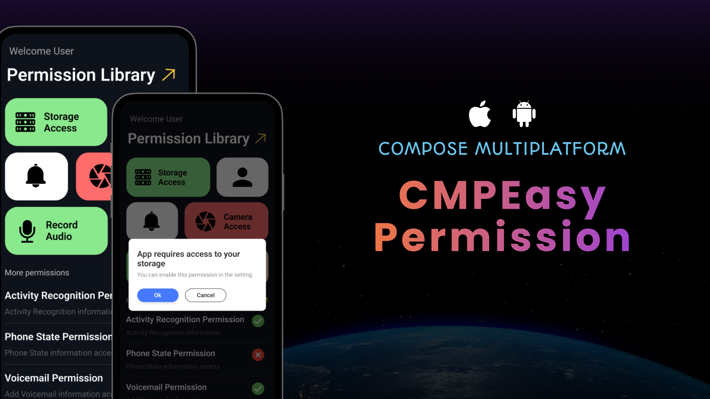

# CMPEasyPermission
[](https://central.sonatype.com/artifact/network.chaintech/cmp-easy-permission)
[](http://kotlinlang.org)
[](https://github.com/JetBrains/compose-multiplatform)


CMPEasyPermission is a simple and easy-to-use permission library for Compose Multiplatform, supporting both Android and iOS platforms.



## 📦 Installation

Add the dependency to your `build.gradle.kts` file:

```
commonMain.dependencies {
    implementation("network.chaintech:cmp-easy-permission:1.0.2")
}
```

## 🎨 Usage

**Android Setup**
- To use the library on Android, you need to declare the necessary permissions in your `AndroidManifest.xml`. Here’s an example for camera permission:

```
<uses-feature android:name="android.hardware.camera"/>
<uses-feature android:name="android.hardware.camera.autofocus"/>
<uses-permission android:name="android.permission.CAMERA"/>
```

**iOS Setup**
- For iOS, you need to add a description for using the camera in the Info.plist of your Xcode project:
```
<key>NSCameraUsageDescription</key>
<string>$(PRODUCT_NAME) camera description.</string>
```

### Code Example

```kotlin

var openCamera by remember { mutableStateOf(false) }
var isGrantedCamera by remember { mutableStateOf<Boolean?>(null) }

if (openCamera) {
    RequestPermission(
        permission = PermissionState.CAMERA,
        openSetting = true,
        deniedDialogParams = DialogParams(
            titleStr = "App requires access to your camera",
            messageStr = "You can enable this permission in the settings",
        ),
        isGranted = { isGranted ->
            isGrantedCamera = isGranted
            openCamera = false
        },
    )
}

Box(
    modifier = Modifier
        .clickable {
            openCamera = true
        }
) {
    // your content
}
```

**Parameters:**
- `permission`: The specific permission you want to request. For example, `PermissionState.CAMERA`.

- `openSetting`: A flag indicating whether to show a prompt allowing the user to open app settings if the permission is denied.

- `deniedDialogTitle`: The title of the dialog shown if the permission is denied.

- `deniedDialogDesc`: The description of the dialog shown if the permission is denied.

- `isGranted`: A callback function that gets invoked with a Boolean indicating whether the permission was granted (true) or denied (false).

## Demo


## 📚 Additional Resources

[Demo Implementation](https://github.com/Chaintech-Network/CMPEasyPermission_org/blob/development/composeApp/src/commonMain/kotlin/network/chaintech/cmpeasypermissiondemo/App.kt) - Check out the demo class to see the library in action.

[](https://medium.com/mobile-innovation-network/cmpeasypermission-a-compose-multiplatform-permission-library-for-android-and-ios-c5ae541b886f)

[](https://www.linkedin.com/showcase/mobile-innovation-network)

## Contributing & Feedback
We appreciate any feedback, bug reports, or feature suggestions to improve **CMPEasyPermission!**

- **Report Issues:** If you encounter any issues or bugs, please open an issue in the [GitHub Issues](https://github.com/Chaintech-Network/CMPEasyPermission/issues) section.
- **Feature Requests:** Have an idea for a new feature? Let us know by creating a feature request issue.
- **General Feedback:** We welcome any suggestions or feedback to enhance the library. Feel free to start a discussion or share your thoughts.
- **Contributions:**  If you’d like to contribute, feel free to submit a pull request. We’re happy to review and collaborate on improvements!

Your support and contributions help make CMPEasyPermission better for everyone! 🚀

## 🌟 If you find this library useful, consider starring ⭐ the repository to show your support!
